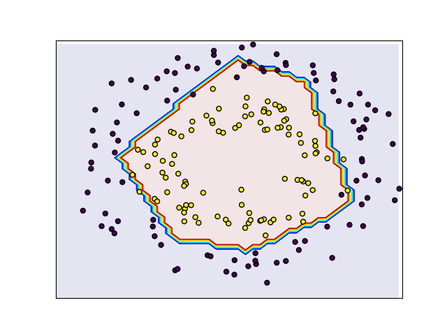

# Neural Network

Use Neural Network for classification task. 

The dataset was created by `sklearn.datasets.make_circles` with 2 features and 2 classes.

Neural Network with 1 hidden layer, 5 nodes, last layer use sigmoid activation function.

Result on test set: 

