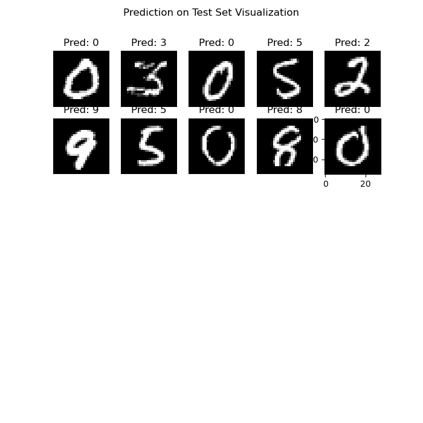

# Neural Network on MNIST dataset

Use Neural Network for classification task. 

MNIST dataset have 10 labels from 0-9 respectively.

Neural Network with 1 hidden layer, 768 nodes. The last layer use softmax activation function.

Result on test set: 

